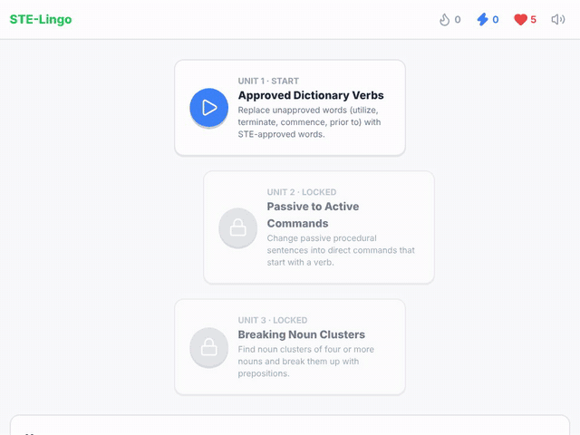
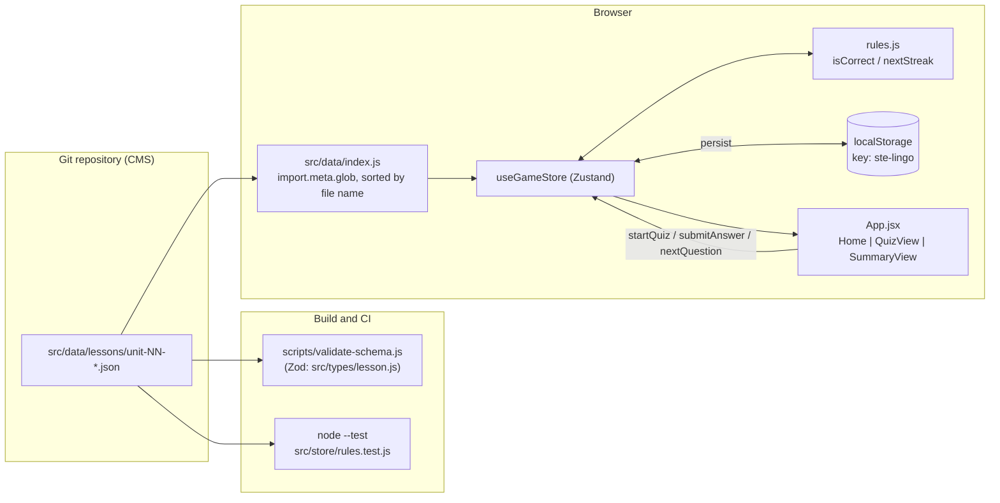
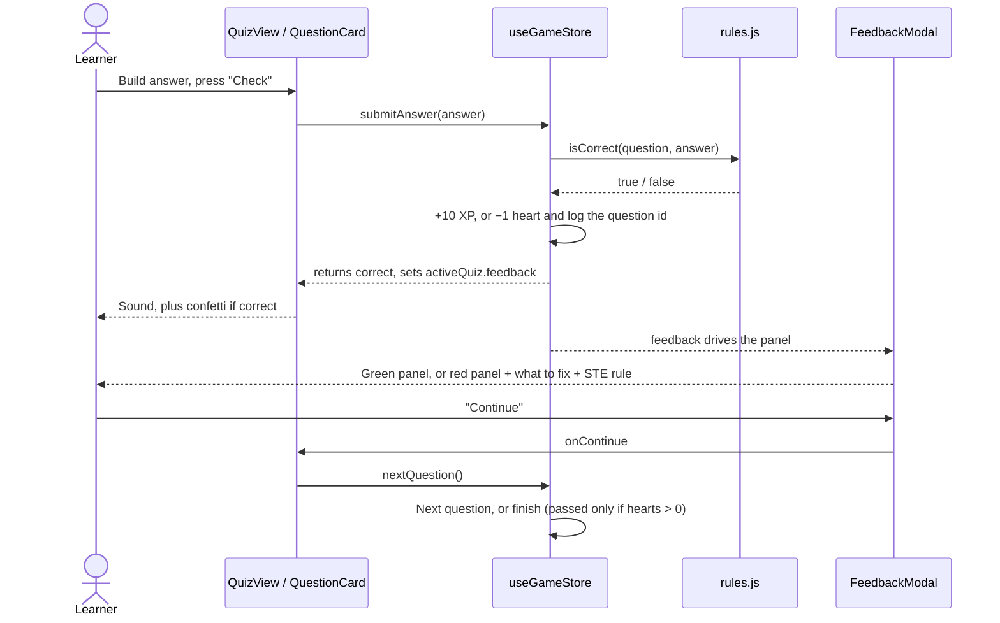

# STE-Lingo

A browser-only, Duolingo-style trainer for ASD-STE100 Simplified Technical English. It is built with React, Vite and Tailwind CSS, and its lessons are JSON files in Git.

[](https://github.com/JFrusher/STE-Lingo/actions/workflows/validate-lessons.yml)




> Unit 1 played start to finish: a wrong synonym-spotter answer (heart lost, red panel with the STE rule), a word bank assembled tile by tile, a `word_limit` rewrite, then the summary with XP and accuracy.

## Key Features

- **Four question types:** `multiple_choice`, `word_bank`, `synonym_spotter` and `word_limit`. Each has its own React component in `src/components/question-types/`.
- **Lessons in Git:** every unit is a JSON file in `src/data/lessons/`. Vite loads them at build time with `import.meta.glob`, so the app needs no backend or database.
- **Schema-checked content:** a strict Zod schema (`src/types/lesson.js`) catches unknown keys, out-of-range indices, word-bank answers the token pool can't build, and duplicate IDs. The check runs before every build and in CI.
- **Progress saved in the browser:** a Zustand store with the `persist` middleware keeps hearts, XP, streak, completed units and the in-progress quiz in `localStorage` under the key `ste-lingo`.
- **Game loop:** 5 hearts, +10 XP per correct answer, a daily streak, and units that unlock in order. A slide-up feedback panel uses `framer-motion` and `canvas-confetti`, and Web Audio tones play on each answer (mute in the top bar).
- **Explanations on every mistake:** each wrong answer shows the correct answer and the lesson's STE rule. The summary screen can list every mistake again.

## Architecture / How It Works

Everything runs in the browser. Lesson JSON is bundled into the build, the Zustand store holds game state, and `App.jsx` picks a page from the store's `activeQuiz` (no router):

| `activeQuiz` | Page shown |
| --- | --- |
| `null` | `Home` (skill tree) |
| set, `finished: false` | `QuizView` |
| set, `finished: true` | `SummaryView` |



One question, from answer to next step:



<details>
<summary><strong>Project layout</strong></summary>

```text
.github/workflows/validate-lessons.yml   CI: validate, lint, test, build on pull requests
scripts/validate-schema.js               Lesson validator (Zod)
src/
├── App.jsx                              Page switch based on activeQuiz
├── components/
│   ├── common/                          HeartBar, ProgressBar, StreakBadge, StatHeader
│   ├── layout/                          TopNav (stats, sound toggle), Sidebar (progress, reset)
│   ├── quiz/                            QuestionCard, QuizHeader, FeedbackModal
│   └── question-types/                  MultipleChoice, WordBank, SynonymSpotter, WordLimit
├── data/
│   ├── index.js                         Loads and orders lessons; getUnit(unitId)
│   └── lessons/                         unit-01 … unit-03 JSON
├── hooks/useSound.js                    Web Audio tones, no audio files
├── pages/                               Home, QuizView, SummaryView
├── store/
│   ├── useGameStore.js                  Zustand store + localStorage persistence
│   ├── rules.js                         Pure grading, word counting, streak logic
│   └── rules.test.js                    node:test suite
└── types/lesson.js                      Zod lesson schema
tailwind.config.js                       Theme tokens (primary, danger, accent, warning)
```

</details>

## Quick Start

**Prerequisites**

| Requirement | Version | Source |
| --- | --- | --- |
| Node.js | `^20.19.0` or `>=22.12.0` (CI uses 22) | Vite 8 `engines` field |
| npm | Included with Node.js | `package-lock.json` |

No API keys, Docker or database are needed.

```bash
git clone https://github.com/JFrusher/STE-Lingo.git
cd STE-Lingo
npm install
npm run dev
```

Open the URL Vite prints (by default `http://localhost:5173`).

### Minimal example: add a unit in 3 steps

**1. Create the lesson file.** The file name must start with its `unitId`.

```bash
cat > src/data/lessons/unit-04-short-sentences.json <<'EOF'
{
  "unitId": "unit-04",
  "unitTitle": "Short Sentences",
  "description": "Keep procedural sentences to 20 words or fewer.",
  "questions": [
    {
      "id": "q1",
      "type": "multiple_choice",
      "prompt": "What is the maximum length of an STE procedural sentence?",
      "options": ["15 words", "20 words", "25 words"],
      "correctIndex": 1,
      "explanation": "STE procedural sentences have a maximum of 20 words."
    }
  ]
}
EOF
```

**2. Validate it and run the tests.**

```bash
npm run validate-lessons && npm test
```

**3. See it in the app.**

```bash
npm run dev
```

Unit 4 shows at the end of the skill tree. It stays locked until Unit 3 is complete.

## Configuration & Environment Variables

> [!NOTE]
> The code reads no environment variables: no `import.meta.env`, no `process.env`, no `.env` file. All behaviour comes from the constants and files below.

| Variable | Type | Default | Description | Required |
| --- | --- | --- | --- | --- |
| `MAX_HEARTS` (`src/store/rules.js`) | `number` | `5` | Starting hearts and the value `resetHearts()` restores | No |
| `XP_PER_CORRECT` (`src/store/rules.js`) | `number` | `10` | XP added per correct answer | No |
| `persist` `name` (`src/store/useGameStore.js`) | `string` | `"ste-lingo"` | `localStorage` key for saved progress | No |
| `maxWords` (per `word_limit` question) | `integer` | none | Word limit for that question; `initialText` must start over it | Yes, on `word_limit` |
| Lesson file name (`src/data/lessons/`) | `string` | none | Must match `unit-NN-*.json` and start with its `unitId`; sets the unit order | Yes |

> [!TIP]
> To start over, use **Reset progress** in the progress panel. It keeps your sound setting.

<details>
<summary><strong>Tailwind theme tokens (<code>tailwind.config.js</code>)</strong></summary>

| Token | Value | Used for |
| --- | --- | --- |
| `primary` / `primary-dark` | `#22c55e` / `#16a34a` | Correct state, progress bar, main buttons |
| `danger` / `danger-dark` | `#ef4444` / `#dc2626` | Hearts, wrong state, flagged words |
| `accent` / `accent-dark` | `#3b82f6` / `#2563eb` | XP, selected options, unlocked units |
| `warning` / `warning-dark` | `#f59e0b` / `#d97706` | Streak flame, trophy |
| `rounded-card` | `1rem` | Cards, buttons, tiles |
| `shadow-btn` / `shadow-btn-pressed` | `0 4px 0` / `0 1px 0` (20% black) | Raised button edge and its pressed state |
| `shadow-card` | `0 2px 0 0 #e5e7eb` | Card bottom edge |

Component classes in `src/index.css`: `.card`, `.btn`, `.tile`, `.tile-selected`, `.tile-flagged`.

</details>

<details>
<summary><strong>Schema rules enforced by <code>npm run validate-lessons</code></strong></summary>

| Rule | Scope |
| --- | --- |
| No unknown keys (`.strict()`) | Lesson and every question |
| `unitId` matches `^unit-\d{2}$` | Lesson |
| File name starts with `<unitId>-`; `unitId` is unique across files | File |
| Question `id`s are unique within a lesson | Lesson |
| All text fields are non-empty after trimming | All |
| `correctIndex < options.length`; at least 2 options | `multiple_choice` |
| Every `correctAnswer` token comes from `tokens`, counting repeats | `word_bank` |
| `unapprovedIndices` has no duplicates and stays within the sentence's word count | `synonym_spotter` |
| `initialText` has more than `maxWords` words | `word_limit` |

The script prints `✓` or `✗` for each file and exits with code `1` on any failure.

</details>

## Usage / API Reference

### npm scripts

| Command | Runs |
| --- | --- |
| `npm run dev` | `vite` dev server |
| `npm run build` | `npm run validate-lessons && vite build` |
| `npm run preview` | `vite preview` of the production build |
| `npm run validate-lessons` | `node scripts/validate-schema.js` |
| `npm test` | `node --test` (finds `src/store/rules.test.js`) |
| `npm run lint` | `oxlint --deny-warnings` |

<details>
<summary>Example <code>validate-lessons</code> output</summary>

```text
✓ unit-01-approved-verbs.json (7 questions)
✓ unit-02-passive-to-active.json (6 questions)
✓ unit-03-noun-clusters.json (6 questions)
```

On failure:

```text
✗ unit-09-broken.json
✖ Unrecognized key: "extra"
  → at questions[1]
✖ correctIndex is out of range
  → at questions[0].correctIndex
```

</details>

### Lesson question types

Every question has `id`, `type`, `prompt` and `explanation`. The other fields depend on the type:

| `type` | Fields | Learner's answer | Correct when |
| --- | --- | --- | --- |
| `multiple_choice` | `options: string[]`, `correctIndex: number` | Option index | Index equals `correctIndex` |
| `word_bank` | `tokens: string[]`, `correctAnswer: string[]` | Token indices, in tap order | The tapped tokens, joined with spaces, equal `correctAnswer` joined with spaces |
| `synonym_spotter` | `sentence: string`, `unapprovedIndices: number[]`, `approvedAlternative: string` | Flagged word indices | Same set as `unapprovedIndices` (order does not matter) |
| `word_limit` | `initialText: string`, `maxWords: number`, `acceptableKeywords: string[]` | Edited text | Word count ≤ `maxWords`, every keyword appears as whole words (case and punctuation ignored), and no unapproved term is left in |

> [!IMPORTANT]
> `synonym_spotter` indices count words from `sentence.split(' ')`, so punctuation stays on its word. In `"Prior to the test, examine the oil level."`, `"test,"` is index 3.

```json
{
  "id": "q2",
  "type": "synonym_spotter",
  "prompt": "Tap the words that are not STE-approved:",
  "sentence": "Prior to the test, examine the oil level.",
  "unapprovedIndices": [0, 1],
  "approvedAlternative": "Before",
  "explanation": "'Prior to' is not approved in STE. Always use 'before'."
}
```

> [!WARNING]
> The unapproved-term check in `word_limit` uses a short fixed list in `src/store/rules.js` (`utilize`, `employ`, `commence`, `initiate`, `terminate`, `ensure`, `inspect` and their forms, plus `prior to` and `in order to`). It is not the full ASD-STE100 dictionary. A wrong answer lists every problem it found.

### Game store (`useGameStore`)

| Member | Kind | Behaviour |
| --- | --- | --- |
| `hearts` | `number` | Starts at `MAX_HEARTS`; −1 per wrong answer |
| `xp` | `number` | +`XP_PER_CORRECT` per correct answer |
| `streak`, `lastActiveDate` | `number`, `"YYYY-MM-DD" \| null` | Updated when a unit is passed. Shown as 0 if the last activity was before yesterday |
| `completedUnits` | `string[]` | Unit IDs passed at least once; unlocks the next unit |
| `activeQuiz` | `object \| null` | `{ unitId, index, correctCount, wrongIds, feedback, finished, passed }` |
| `startQuiz(unitId)` | action | Starts a fresh quiz |
| `submitAnswer(answer)` | action | Grades the current question, sets `feedback` and returns `true`/`false` |
| `nextQuestion()` | action | Moves to the next question, or finishes. Passes only if hearts remain; then calls `completeUnit` |
| `completeUnit(unitId)` | action | Marks the unit complete and updates the streak |
| `resetHearts()` | action | Sets hearts back to `MAX_HEARTS` |
| `exitQuiz()` | action | Sets `activeQuiz` to `null` |
| `soundOn`, `toggleSound()` | `boolean`, action | Sound preference, saved with progress |
| `resetProgress()` | action | Clears hearts, XP, streak, completed units and the active quiz; keeps `soundOn` |

```js
import { useGameStore } from './store/useGameStore.js'

const { startQuiz, submitAnswer, nextQuestion } = useGameStore.getState()
startQuiz('unit-01')
submitAnswer(1) // unit-01 q1 is multiple_choice, correctIndex 1
nextQuestion()
console.log(useGameStore.getState().xp) // previous XP + 10
```

> [!CAUTION]
> When saved progress loads, any `activeQuiz` whose `unitId` no longer exists, or whose `index` is past the unit's last question, is dropped. Renaming a unit or removing questions ends in-progress quizzes but keeps XP, hearts and completed units.

## Roadmap

- [x] Vite + React + Tailwind CSS v3 scaffold with theme tokens
- [x] Three ASD-STE100 units: approved verbs, passive to active, noun clusters
- [x] Zustand game store saved to `localStorage`
- [x] Multiple choice, word bank, synonym spotter and word limit cards
- [x] Feedback panel with confetti, shake and STE rule explanation
- [x] Skill tree with locked units; summary with XP, accuracy and mistake review
- [x] Zod lesson validator and GitHub Actions CI
- [x] Sound effects with a mute toggle (synthesized, no audio files)
- [x] Unapproved-word detection in `word_limit` answers (fixed list)
- [x] Progress panel with reset
- [x] Demo GIF
- [ ] Heart refill over time (today: a manual "Refill hearts" button at 0 hearts)
- [ ] Lesson review against the official ASD-STE100 dictionary (word swaps were checked against third-party reproductions only)
- [ ] `LICENSE` file

## Contributing & License

1. Fork the repo and create a branch from `main`.
2. Make your change. For lesson changes, edit only `src/data/lessons/*.json`.
3. Run the same checks as CI:

   ```bash
   npm run validate-lessons
   npm run lint
   npm test
   npm run build
   ```

4. Open a pull request against `main`. The **Validate lessons** workflow runs all four checks and must pass.

> [!IMPORTANT]
> **License:** none yet. The repo has no `LICENSE` file, so default copyright applies and others have no right to reuse the code. Add a `LICENSE` file (for example MIT) before you accept outside contributions, then update the badge above.
